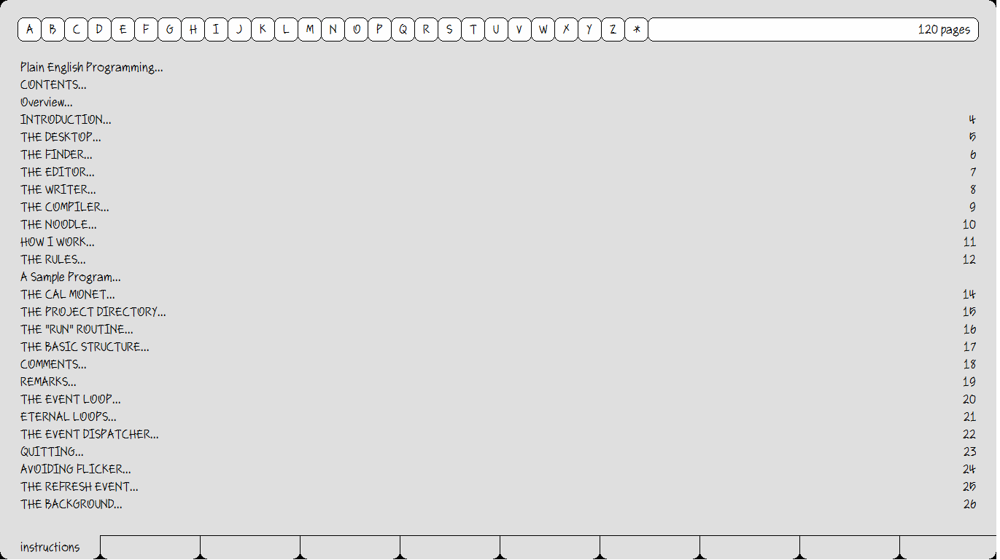
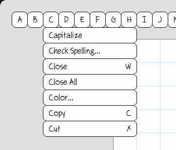
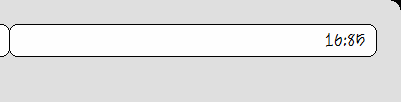
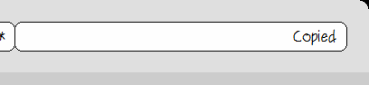
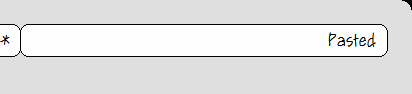
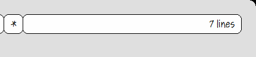
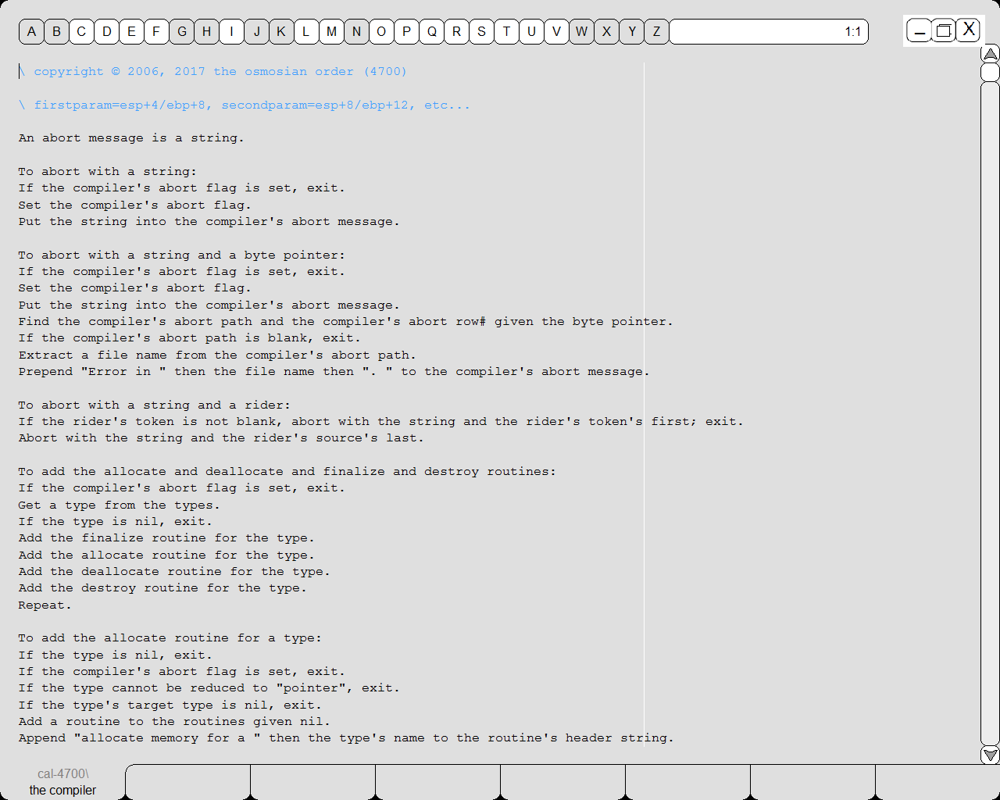

# Portugues-Puro

 

 

Este Projeto é baseado na [Plain English Programming Language](http://osmosianplainenglishprogramming.blog/).
Os arquivos originais do projeto podem ser obtidos [aqui](http://www.osmosian.com/cal-4700.zip) e na pasta [cal-4700](https://github.com/elenderg/Portugues-Puro/tree/main/recursos/cal-4700%20ingl%C3%AAs).
A documentação original (em inglês) está disponível [aqui](http://www.osmosian.com/instructions.pdf) e na pasta [documentation](https://github.com/elenderg/Portugues-Puro/tree/main/recursos/cal-4700%20ingl%C3%AAs/documentation).

# Estrutura dos Arquivos

O projeto é composto de basicamente 6 arquivos:

 1. The compiler (que contém as funções do compilador)
 2. The desktop (contém as funções de gerenciamento das cores, botões e demais aspectos da interface geral do programa)
 3. The editor (contém as funções relacionadas ao editor de texto integrado da IDE/ADI)
 4. The finder (contém as funções do explorador de arquivos)
 5. The noodle (contém as definições necessárias para o funcionamento do compilador)
 6. The writer (contém funções para o editor WYSIWYG da plataforma)

## Funcionamento

A interface pode parecer confusa para alguns no começo. Existem 26 caracteres de A a Z, cada um correspondendo a um menu específico,  

- além do botão **＊** que é utilizado para selecionar a paleta de cores. 
 

Boa parte dos sub-menus possui uma tecla de atalho que pode ser acessada com _Ctrl_ ou _Alt_ (na maior parte das vezes qualquer uma das teclas funciona).

Ao lado dos botões existe uma barra que exibe informações diversas, dependendo do contexto, por exemplo: 

 - linha e coluna
 
 - texto copiado
 
 - texto colado
 
 - quantidade de linhas selecionadas
 
 

No momento o programa ainda não possui barra de rolagem nem botões de Maximizar, Minimizar ou Fechar. (Para sair do Programa, pressione <kbd>Alt+F</kbd>, para Fechar um arquivo, pressione <kbd>Ctrl + W</kbd> . Para descer linhas utilize a seta para baixo <kbd>↓</kbd> ou clique com o botão direito do mouse e arraste.

Existem projetos como o [CAL-4018](https://github.com/Folds/english) que adicionam esses elementos, porém o foco agora é traduzir a interface e a linguagem para o Português Brasileiro.
 
